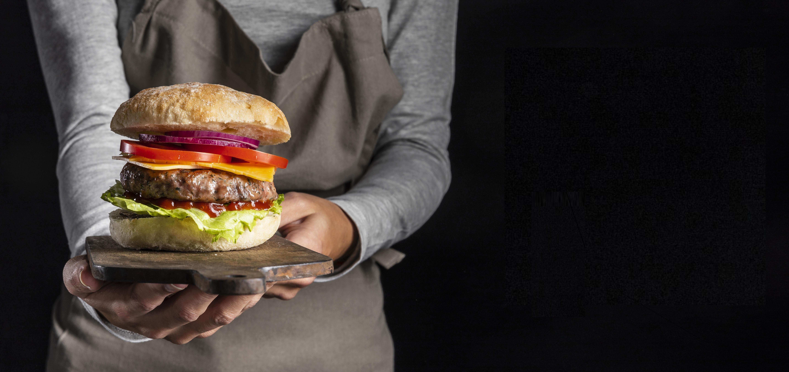
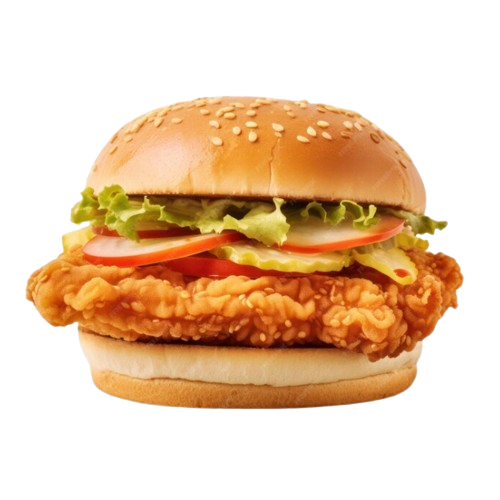
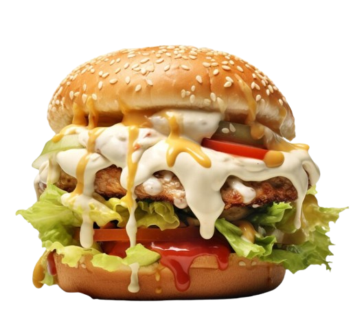
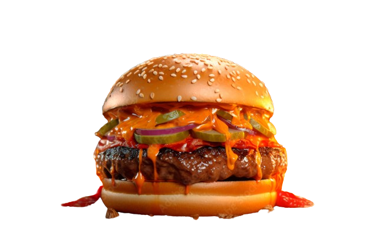

# LE PALAIS DU BURGER

## Description
Ce projet est une création de site web du restaurant "Le Palais du Burger"  une vitrine en ligne de notre établissement gastronomique situé au cœur d'Ottawa, en Ontario.
Conçu pour offrir une expérience immersive à nos visiteurs, notre site présente une interface conviviale et attrayante qui reflète 
l'atmosphère chaleureuse et décontractée de notre restaurant.

## Fonctionnalités
- [ ] Page d'accueil avec présentation de notre projet
- [ ] Qui sommes-nous
- [ ] Menu (Burger Classique / Burger Spécialité)
- [ ] Contact
- [ ] Inscription
- [ ] Nous joindre

## language Utilisées
- HTML5
- CSS 

## Captures d'écran

.png)

## Auteurs 
- [Maziz Jugurta et Abderraouf Chelouche ](https://github.com/Jugurta18/MJ)

## Licence
Ce projet est sous licence [&copy; 2024 Le Palais du Burger. Tous droits réservés].
